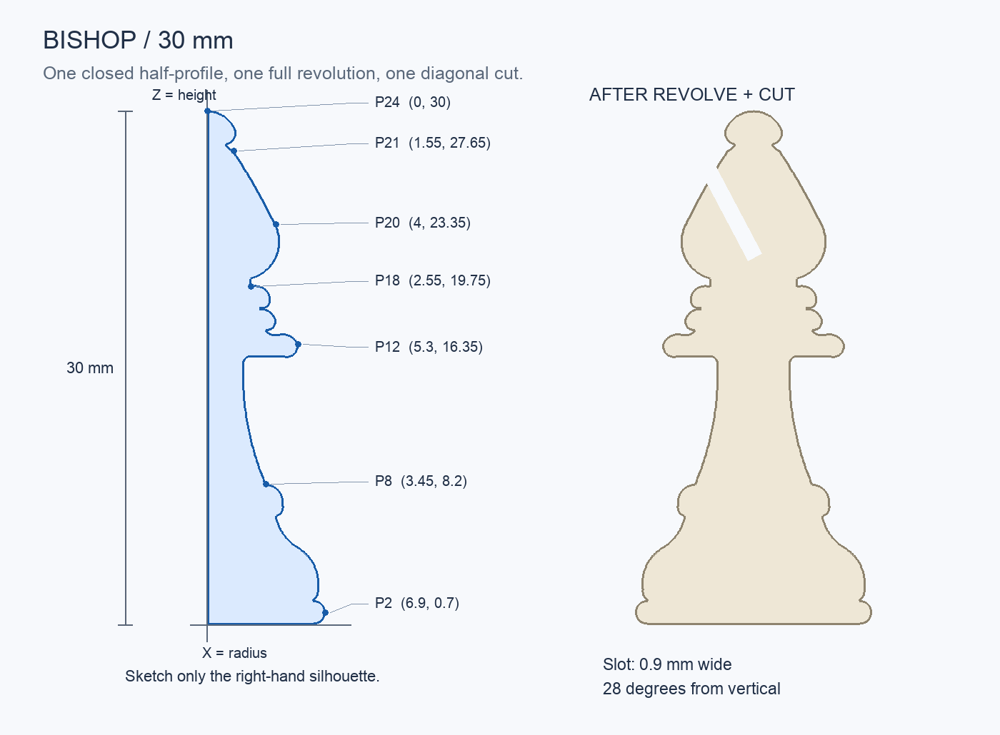
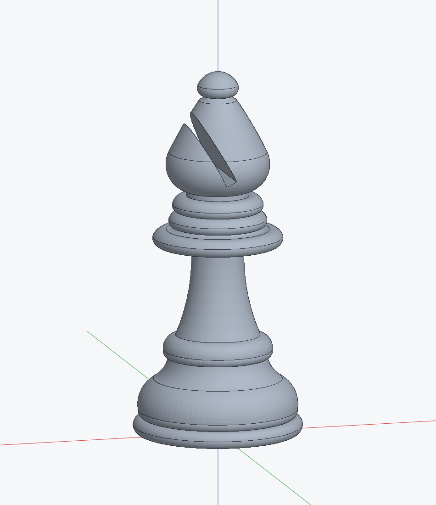

# Build a 30 mm bishop in Ferrender

This tutorial recreates the photo-based bishop using Ferrender's desktop tools: draw a closed side profile, revolve it, and cut the diagonal slot. Start from a blank document; no scripts, API commands, imported solids, or AI assistant are required.

The silhouette matches the supplied bishop model closely. Its proportions were estimated from one photograph; only the 30 mm total height was specified. The red annotation on the photograph is not part of the piece.

The same steps work in 0.3.0; **S** now opens command search and **V** chooses Select. This tutorial targets **Ferrender 0.2.2**, whose three-point arc tool uses **start → end → bulge**. Builds 0.2.0 and 0.2.1 used start → bulge → end; use the [0.2.0 tutorial](https://github.com/base698/ferrender/blob/v0.2.0/BISHOP_TUTORIAL.md) with those builds. Check **Help → About Ferrender** for the version and source commit before testing. The geometric recipe was verified for 0.2.0 using the point-coordinate and three-point-arc commands: 45 positioned outline/through points, 25 outline edges, a fully constrained closed profile, and one exact 30 mm solid. Resizing to 36 mm and exporting STL/STEP also passed. Automated offscreen tests exercise the new controls, but the complete human mouse-and-keyboard walkthrough remains a manual acceptance check. The [0.1.0 instructions](docs/tutorials/BISHOP_0.1.md) are preserved for older builds.

## What you will make

| Detail | Size |
|---|---|
| Overall height | 30 mm |
| Maximum base diameter | 13.8 mm |
| Largest collar diameter | About 10.6 mm |
| Diagonal slot width | 0.9 mm |
| Slot direction | 28° left of vertical, when viewed from the front |
| Slot cutting depth | 16 mm total, symmetric about the front plane |

The outline is the detailed part of this exercise. Work on the base, stem, collars, and head in separate sessions if helpful. Save between sections.

## 1. Start a millimeter document

1. Choose **File → New**. Save an existing design before replacing it.
2. In the bottom status bar, set **Units** to **mm**.
3. Choose **File → Save As…** and name the document `bishop-tutorial.ferr`.
4. Choose **Edit → Parameters…**. In the new row, enter `total_height` as the name and `30 mm` as the expression, then click **Add**. Close the Parameters window.

This parameter will control a final scale feature. The outline itself is drawn at 30 mm. Do not also use `total_height` to drive the outline's height: that would apply the size change twice when the scale feature is added.

## 2. Start the side-profile sketch

1. Choose **Sketch → New Sketch**.
2. Leave **Offset** at zero and click **XZ (front)**.
3. Use **Look At** in the Sketch Palette if you need to face the sketch squarely.
4. Keep **Construction** off for now. Turn **Snap to Grid** off for the precise small details; snapping to existing points still works.

On this sketch, horizontal is world **X** and vertical is world **Z**. In the tables below, `(X, Z)` means **radius from the centerline, height above the bottom**. A radius of 6.9 mm makes a diameter of 13.8 mm after revolving.

## 3. Enter the outline points directly

Choose **Select** (`V` in 0.3.0; `S` in 0.2.2) and click empty sketch space to clear the selection. Choose **Sketch → Point Coordinates…** to create a point. Enter its **X** and **Y** coordinates and click **Place Point**. The dialog remains open so you can enter the next point without reopening it. These are **sketch** coordinates: in this XZ sketch, the dialog's **Y** is the table's **Z height**.

Start with **P1**: enter **X = `6.2 mm`**, **Y = `0 mm`**, then click **Place Point**. The signs matter; negative coordinates go left or below the origin. The fields accept length expressions as well as literal millimeters. The coordinates are held by position dimensions, so changing a parameter in an expression moves the point and its attached outline.

Continue with **P2 through P24**, using the **End point** column in the next table. For P2, use X = `6.9 mm` and Y = `0.7 mm`. After each **Place Point**, replace X/Y with the next pair and place it. **New Point** returns the dialog to new-point entry with zero coordinates. Opening the dialog with a point selected edits that point instead. **P0 already exists at the origin**, so do not add another point there. The labels P0–P24 are names used in this tutorial, not automatic point labels in the app.

To correct a point later, select it and reopen **Point Coordinates…**, or double-click the point. **Apply Coordinates** applies the edit and closes the dialog. Do not drag a point whose two coordinates are dimensioned and expect it to move freely; edit its coordinates instead. Hide **Show Dimensions** temporarily if the position dimensions obscure the outline. Hiding them does not remove them.

Click **Close** to leave the coordinate dialog, then choose **Line** (`L`). Snap from **P0 to P1**, then press **Escape** to end the chain. Draw another ordinary line from **P24 to P0** and end the chain. Use the point-snap indicator at both ends. These are edges 1 and 25 in the table: do not draw them a second time.

Use **View → Fit** (`F`) and zoom as needed. You should have all the outline points, a 6.2 mm bottom edge, and a 30 mm vertical edge. You are drawing only the right side of the bishop. Keep the vertical axis edge as ordinary geometry because it closes the region for Revolve.

## 4. Connect the profile with lines and three-point arcs

Keep **Construction off**. For each arc, you need its two outline endpoints and one point on the bulge. The through points are labeled T2, T3, and so on to match their edge numbers. Use **Point Coordinates…** to enter those points just as you entered P1–P24. They are real points on the eventual curve, not circle centers. Click **Close** when you have entered them, before switching to the drawing tools.

For every **3-Point Arc** row:

1. Choose **Sketch → 3-Point Arc**.
2. Snap to the row's **From** point, then its **To** point, then its **Through point**. For edge 2, that is **P1 → P2 → T2**. The first two clicks fix the ends; the third chooses the bulge.
3. Compare the bulge with the diagram. The curve should pass through all three points. The through point stays attached to the arc if its coordinates change later.
4. Do not add a radius or tangent constraint to this recipe: the three dimensioned points already determine the circle.

For a **Line** row, choose **Line**, snap to its two endpoints, then press **Escape** to end the chain. Do not add another length dimension to a line whose endpoints already have X/Y coordinates.

**Edges 1 and 25 already exist from step 3. Do not draw them again.** Start at edge 2 and work down the table. Through points come from the supplied model's original circular construction; the last one is rounded to six decimal places. You only need to type these values, not place the mouse to that precision.

| Edge | From → to | End point (X, Z), mm | Tool | Through point (X, Z), mm |
|---|---|---|---|---|
| 1 | P0 → P1 | (6.2, 0) | Line | — |
| 2 | P1 → P2 | (6.9, 0.7) | 3-Point Arc | T2 = (6.694975, 0.205025) |
| 3 | P2 → P3 | (6.2, 1.4) | 3-Point Arc | T3 = (6.694975, 1.194975) |
| 4 | P3 → P4 | (6.5, 2) | 3-Point Arc | T4 = (6.42, 1.62) |
| 5 | P4 → P5 | (5.25, 4.55) | 3-Point Arc | T5 = (6.15, 3.7) |
| 6 | P5 → P6 | (4.05, 6.3) | 3-Point Arc | T6 = (4.35, 5.5) |
| 7 | P6 → P7 | (4.45, 6.95) | 3-Point Arc | T7 = (4.38, 6.55) |
| 8 | P7 → P8 | (3.45, 8.2) | 3-Point Arc | T8 = (4.2, 7.8) |
| 9 | P8 → P9 | (2.15, 15.2) | 3-Point Arc | T9 = (2.35, 12) |
| 10 | P9 → P10 | (2.45, 15.6) | 3-Point Arc | T10 = (2.24, 15.49) |
| 11 | P10 → P11 | (4.45, 15.6) | Line | — |
| 12 | P11 → P12 | (5.3, 16.35) | 3-Point Arc | T12 = (5.25, 15.98) |
| 13 | P12 → P13 | (4.2, 16.95) | 3-Point Arc | T13 = (4.92, 16.82) |
| 14 | P13 → P14 | (3.45, 17.15) | 3-Point Arc | T14 = (3.65, 17) |
| 15 | P14 → P15 | (4, 17.8) | 3-Point Arc | T15 = (3.96, 17.45) |
| 16 | P15 → P16 | (3.05, 18.45) | 3-Point Arc | T16 = (3.75, 18.2) |
| 17 | P16 → P17 | (3.7, 19.02) | 3-Point Arc | T17 = (3.65, 18.7) |
| 18 | P17 → P18 | (2.55, 19.75) | 3-Point Arc | T18 = (3.5, 19.48) |
| 19 | P18 → P19 | (2.55, 20.15) | Line | — |
| 20 | P19 → P20 | (4, 23.35) | 3-Point Arc | T20 = (3.9, 21.15) |
| 21 | P20 → P21 | (1.55, 27.65) | 3-Point Arc | T21 = (3.15, 25) |
| 22 | P21 → P22 | (1.1, 28) | 3-Point Arc | T22 = (1.25, 27.85) |
| 23 | P22 → P23 | (1.65, 28.9) | 3-Point Arc | T23 = (1.6, 28.35) |
| 24 | P23 → P24 | (0, 30) | 3-Point Arc | T24 = (0.991527, 29.69979) |
| 25 | P24 → P0 | (0, 0) | Line | — |

### Recognize the sections as you go

- **Edges 2–8:** rounded foot and bell-shaped base.
- **Edges 9–10:** long concave stem and its transition into the collars.
- **Edges 11–18:** three turned collars. Edge 11 is a short horizontal ledge.
- **Edge 19:** short vertical neck under the head.
- **Edges 20–22:** pear-shaped bishop head.
- **Edges 23–24:** small rounded finial, ending exactly at the top of the 30 mm axis line.

**Checkpoint:** the ordinary lines and arcs form one closed loop from the origin, around the right-hand outline, to the top, and back down the axis. Leave **Highlight Open Ends** enabled in the Sketch Palette and check for orange endpoint rings. They identify unconnected ends; they do not guarantee that an outline is free of overlaps or self-intersections. Through points on arcs are not open outline ends. Save the file.

## 5. Revolve the outline into a solid

1. Click **Finish Sketch**.
2. Choose **Model → Revolve**. If necessary, select the outline sketch in the timeline first.
3. Check **Profiles**. Select the single closed half-profile in the viewport if it is not already selected.
4. Set **Axis = Y** and **Angle = 360 deg**.
5. Set **Operation = New Body**, inspect the preview, and click **OK**.

**Why Y, when the finished bishop is vertical in Z?** The Revolve dialog's X and Y axes belong to the sketch. On an XZ sketch, the sketch's Y direction is world Z. Revolving about sketch X would turn the shape around the wrong axis.

Choose **View → Home** and **View → Fit**. Select the body in the Browser and inspect its status-bar dimensions. It should be approximately **13.8 × 13.8 × 30 mm**, and identified as an **exact** body. The head is still solid at this point.

Right-click the sketch's timeline chip and choose **Rename**: `Turned bishop outline`. Rename the revolve `Turned base stem collars and head`. Save again.

## 6. Draw the diagonal slot

Use a fresh origin plane, not a face on the curved head.

1. Choose **Sketch → New Sketch**, leave **Offset = 0**, and select **XZ (front)** again.
2. Face the sketch with **Look At**. If the solid gets in the way, temporarily hide the body with its Browser visibility control. Restore its visibility before previewing the cut.
3. Use **Sketch → Point Coordinates…** to create the four corners below. Enter each signed X directly; enter Z in the dialog's **Y** field. For A, use X = `-0.297326 mm` and Y = `21.238738 mm`. Use **Place Point** for each pair; use **New Point** if the dialog was editing a selected point.
4. Close the coordinate dialog. Keep **Construction off**, choose **Line**, and connect **A → B → C → D → A**, snapping to the existing points. End the line chain.

| Corner | X, mm | Z, mm |
|---|---|---|
| A | -0.297326 | 21.238738 |
| B | 0.497326 | 21.661262 |
| C | -4.197389 | 30.490738 |
| D | -4.992042 | 30.068214 |

This is a narrow, tilted rectangle drawn with four lines. The standard Rectangle tool makes an axis-aligned rectangle, so use the four entered points and Line here.

The slot is **0.9 mm wide measured perpendicular to its long sides**, **10 mm long**, and tilted **28° left from vertical**. Its bottom-center is approximately **(0.10, 21.45)**. The top corners intentionally extend above and outside the head; this is what opens the cut to the outside instead of making an enclosed pocket.

Click **Finish Sketch** and rename this sketch `Diagonal mitre slot 0.9 mm`.

## 7. Cut through the head

1. Restore the body's visibility if you hid it.
2. With the slot sketch selected, choose **Model → Extrude**.
3. Select the narrow closed slot profile.
4. Set **Distance = 16 mm**, leave **Through all** unchecked, and leave **Taper** empty or at `0 deg`.
5. Tick **Symmetric** and set **Operation = Cut**.
6. Inspect the preview and click **OK**. Rename the feature `Cut diagonal slot through head`.

**Symmetric means 16 mm total: 8 mm on each side of the sketch plane.** This passes through the full head. You should still have one connected bishop, not a separate cutter body.

Use **View → Front** to check the diagonal opening. Then orbit slightly to see its depth. The stem, collars, and base should be untouched. Save.

## 8. Add the overall-height control

The complete shape is already 30 mm high. Add a final uniform scale feature so one parameter resizes the entire piece, including the slot.

1. Select the bishop body.
2. Choose **Model → Move / Rotate / Scale**.
3. Leave **Move X/Y/Z** at zero and **Rotate X/Y/Z** at zero.
4. Enter **`$total_height / (30 mm)`** in **Scale** and click **OK**.
5. Rename the feature `Overall height from total_height`.

With `total_height = 30 mm`, the scale is 1. As a check, change the parameter to `36 mm`: the whole bishop should become 36 mm tall and the base 16.56 mm wide. Restore it to **30 mm**, then save. Scaling also changes slot width: it would become 1.08 mm at 36 mm height.

## 9. Check and export

Your timeline should contain these five features:

1. Turned bishop outline — sketch.
2. Turned base stem collars and head — revolve.
3. Diagonal mitre slot 0.9 mm — sketch.
4. Cut diagonal slot through head — extrude cut.
5. Overall height from total_height — scale.

Select the body and check that the final height is **30 mm**. Look for failed-feature messages in the status bar and error-marked timeline chips. Confirm the base is flat, the finial is round, the slot opens through the head, and the document contains one body.

Choose **File → Save** to preserve the editable `.ferr` design. Choose **File → Export STL…** for printing; export in millimeters and use 100% scale in the slicer. Choose **File → Export STEP…** if you also want the exact solid for another CAD program.

When experimenting with the timeline, hold and move the marker to choose a position, then release to rebuild. The model stays unchanged while the marker is held. Wait for **Updating model…** to finish before starting another drag; **Escape** cancels a drag.

## Troubleshooting

| What you see | What to check |
|---|---|
| Revolve has no closed profile | Turn on **Highlight Open Ends** in the Sketch Palette. Snap a missing connection to the existing point, or select two free endpoints and apply Coincident. If fixed coordinates conflict, correct those coordinates first. Verify the axis edge is ordinary geometry. |
| Many extra regions appear | Look for duplicate edges or ordinary tracing guides. Remove duplicates or make guides construction geometry; keep the actual outline ordinary. |
| A three-point arc is refused | Check the three coordinates, their units, and click order. Distinct points on one straight line cannot define an arc. |
| A shallow curve appears enormous or backwards | In 0.2.2, use start → end → through. The last click must be the T point for that row, not a guessed center or another P point. |
| A finial or collar looks angular | Check whether you accidentally used Line in place of Arc. Some visible surface faceting is display tessellation; STEP preserves the exact curved surfaces. |
| Revolve makes a sideways shape | Use the sketch's Y axis on the XZ sketch. |
| The cut does nothing | Check Operation = Cut, that the slot is a closed ordinary profile, and that its lower end intersects the head. |
| Only one side of the head is cut | Tick Symmetric; the sketch is at the middle of the body, not on its outside face. |
| Two bodies appear | The slot extrusion was probably New Body. Edit that feature and change it to Cut. |
| Changing total_height does nothing | Check the final scale expression, and make sure the timeline is rolled to the end. |
| Size changes twice | Use a literal 30 mm for the source outline and the parameter only in the final scale feature. |
| Fit zooms much farther out while sketching | Fit includes arc-center points. Pan and zoom manually around the part. |
| A coordinate edit fails | The point may be fixed or constrained by other geometry. Undo an unintended constraint rather than adding conflicting dimensions. |

## Trace and refine a different bishop

The numeric recipe above reproduces the supplied model. The new sketching tools also support a less rigid workflow for making your own interpretation of a photograph. Save a separate copy before replacing dimensions or curves.

### Bring in a reference photograph

1. While editing the XZ outline sketch, choose **Sketch → Reference Image… → Choose Image…** and import your PNG or JPEG.
2. Reduce **Opacity** so the lines remain visible. Adjust **Origin X**, **Origin Y**, and **Rotation** to put the photographed centerline upright over the sketch axis, then click **Apply**. The origin is the image's lower-left corner, not the piece's bottom-center. In Select, drag an empty part of the image to move it, or select it and drag a square corner handle to scale around the opposite corner. Sketch geometry takes priority over the image body. Reopen the dialog for exact placement.
3. Choose **Calibrate from Two Points…**, then pick the bottom and top of the photographed piece. In the reopened dialog, enter **Known distance = `30 mm`** and click **Calibrate and Apply**. The first selected point stays in place during scaling. Check the centerline and base alignment again.
4. Draw over the visible silhouette. The image is embedded in the `.ferr` document and is only a tracing aid; it contributes no solid geometry and is not exported to STL or STEP.

A single angled photo cannot establish hidden dimensions or eliminate perspective distortion. Calibrating a visible height sets the drawing scale; it does not make every measured width physically exact. The red mark on the supplied photo is an annotation, not a groove to model. A second straight-on photo and a few measured diameters would improve the copy more than adding more points to an uncertain silhouette.

### Use curves without finding their centers

- **3-Point Arc:** click the start and end, then a point on the desired bulge. The last click is on the arc, not its center. This is convenient for the stem and head, whose circle centers lie far from the silhouette. Three points on a straight line cannot define a circle.
- **Tangent Arc:** start at an existing line or arc endpoint, then click the new end. Select the source curve first if several curves meet at the junction. Use this for a smooth continuation when redesigning an outline. Do not add tangency indiscriminately to the dimensioned recipe above: its independent circles and fixed endpoints may conflict with it.
- **Spline:** click four fit points in order. The curve passes through those points; the inner points are not Bezier handles. Use Select to drag free fit points, or double-click a fit point to enter coordinates. Keep the first and last points shared with neighboring edges so the result can close into a profile. A spline can simplify a freeform head or stem, but replacing the recipe's arcs changes its shape.

### Close the region deliberately

Enable **Highlight Open Ends** in the Sketch Palette (on by default). Orange endpoint rings and the open-end count point out places where the ordinary outline ends without a connection; construction guides are excluded. Zoom in, then redraw a missing edge by snapping to existing points, or select two endpoints and apply **Coincident**. Coordinate dimensions can prevent two points with different fixed positions from merging: correct the positions first. No orange markers is a useful check, not proof of a valid region; duplicate, crossing, or self-intersecting geometry can still prevent modeling.

Finish the sketch and confirm that Revolve offers exactly the intended half-profile before continuing. For supported spline operations, image limits, and detailed checks of these tools, use the [0.2 sketching guide and manual test plan](docs/adrs/0001-sketching-tools.md).

## Remaining useful improvements

The existing solid tools were sufficient for this model. A finer optional display tessellation would make subtle surface curves easier to judge, and more extensive spline constraints would help with later reshaping. The limitations and supported operations of the first spline implementation are described in the sketching guide. Better source photographs and measurements remain necessary for a closer physical match.

The matching pawn exposed a separate API number-parsing problem with scientific notation near zero. The 0.2 work includes accepting expressions such as `1e-6 mm` and numeric JSON values written with exponents. That input correction does not change the modeling method and does not require a workaround in this human tutorial.

## Alternative: the original center-and-radius recipe

This table preserves the circular recipe used for the 0.1 tutorial. Use it **instead of** the three-point arc rows above if you prefer the original **Arc** tool (`A`), which takes **center → start → end**. Draw roughly at the center hint, snap to the two coordinate-dimensioned endpoints, then use **Dimension** (`D`) to set the radius. Leave the center free to move. Do not place or constrain the T through points for this alternative, and do not draw duplicate curves over the completed three-point outline.

The rounded radii give a very close recreation of the original circles. Some centers lie well outside the part: edge 9 is near X = 18.5 mm, and edge 21 near X = −29 mm. This is the placement effort the three-point tool avoids.

| Edge | From → to | End point (X, Z), mm | Tool | Approximate arc center (X, Z), mm | Radius, mm |
|---|---|---|---|---|---|
| 1 | P0 → P1 | (6.2, 0) | Line | — | — |
| 2 | P1 → P2 | (6.9, 0.7) | Arc | (6.2, 0.7) | 0.7 |
| 3 | P2 → P3 | (6.2, 1.4) | Arc | (6.2, 0.7) | 0.7 |
| 4 | P3 → P4 | (6.5, 2) | Arc | (5.89, 1.93) | 0.614003 |
| 5 | P4 → P5 | (5.25, 4.55) | Arc | (4.05431, 2.382505) | 2.475421 |
| 6 | P5 → P6 | (4.05, 6.3) | Arc | (6.721839, 6.84569) | 2.726995 |
| 7 | P6 → P7 | (4.45, 6.95) | Arc | (3.90059, 6.840022) | 0.56031 |
| 8 | P7 → P8 | (3.45, 8.2) | Arc | (3.336628, 7.084302) | 1.121443 |
| 9 | P8 → P9 | (2.15, 15.2) | Arc | (18.499275, 14.61558) | 16.359717 |
| 10 | P9 → P10 | (2.45, 15.6) | Arc | (2.499216, 15.250588) | 0.352861 |
| 11 | P10 → P11 | (4.45, 15.6) | Line | — | — |
| 12 | P11 → P12 | (5.3, 16.35) | Arc | (4.630505, 16.252094) | 0.676616 |
| 13 | P12 → P13 | (4.2, 16.95) | Arc | (4.402561, 16.013028) | 0.958618 |
| 14 | P13 → P14 | (3.45, 17.15) | Arc | (3.987069, 17.657759) | 0.739095 |
| 15 | P14 → P15 | (4, 17.8) | Arc | (3.480225, 17.682117) | 0.532975 |
| 16 | P15 → P16 | (3.05, 18.45) | Arc | (3.11408, 17.524425) | 0.92779 |
| 17 | P16 → P17 | (3.7, 19.02) | Arc | (3.200348, 18.934164) | 0.506971 |
| 18 | P17 → P18 | (2.55, 19.75) | Arc | (2.825567, 18.91329) | 0.88092 |
| 19 | P18 → P19 | (2.55, 20.15) | Line | — | — |
| 20 | P19 → P20 | (4, 23.35) | Arc | (1.973258, 22.339852) | 2.264527 |
| 21 | P20 → P21 | (1.55, 27.65) | Arc | (-29.031129, 7.377903) | 36.690099 |
| 22 | P21 → P22 | (1.1, 28) | Arc | (2.2, 28.95) | 1.453444 |
| 23 | P22 → P23 | (1.65, 28.9) | Arc | (0.994903, 28.682282) | 0.690329 |
| 24 | P23 → P24 | (0, 30) | Arc | (0, 28.2125) | 1.7875 |
| 25 | P24 → P0 | (0, 0) | Line | — | — |
