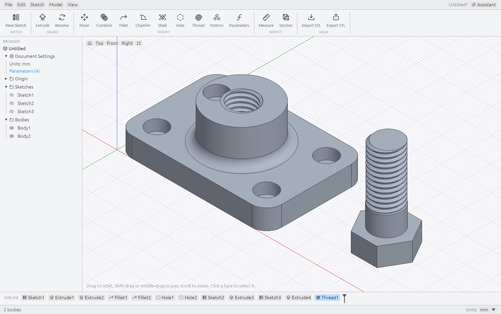
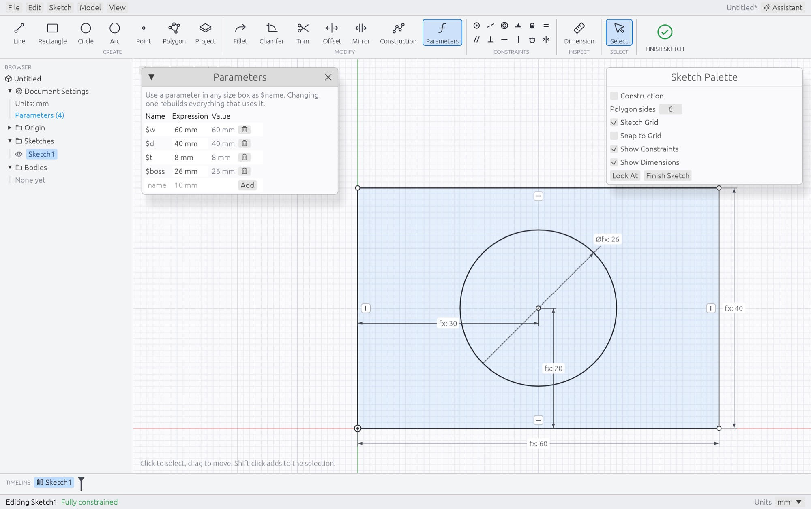
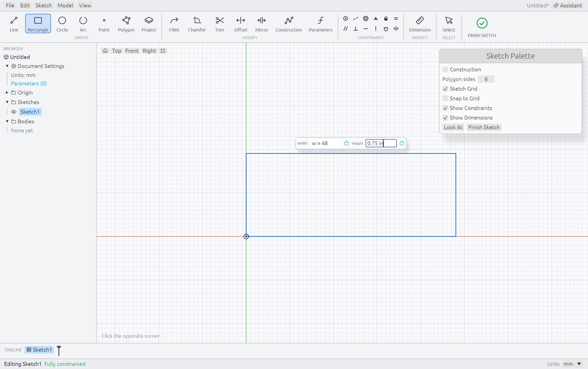
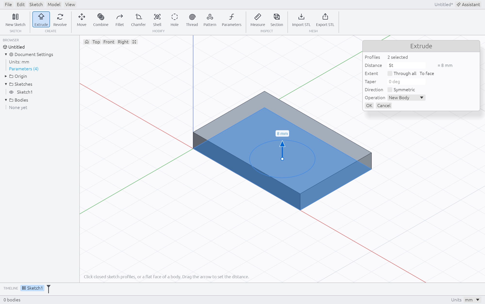
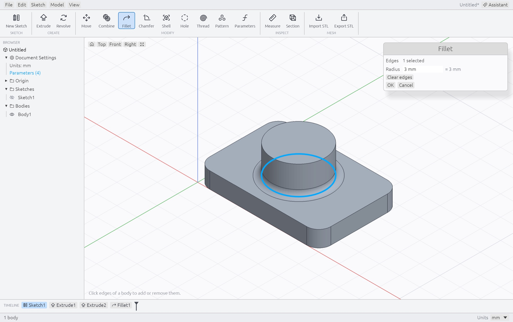
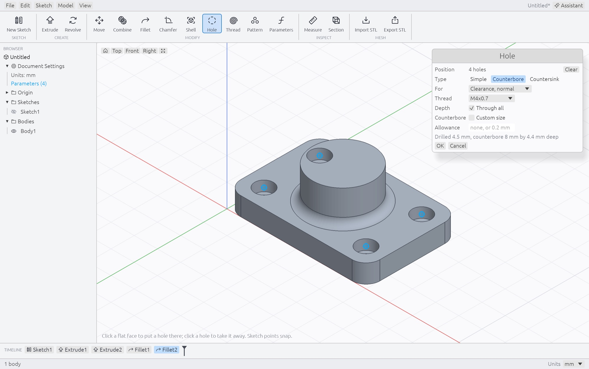
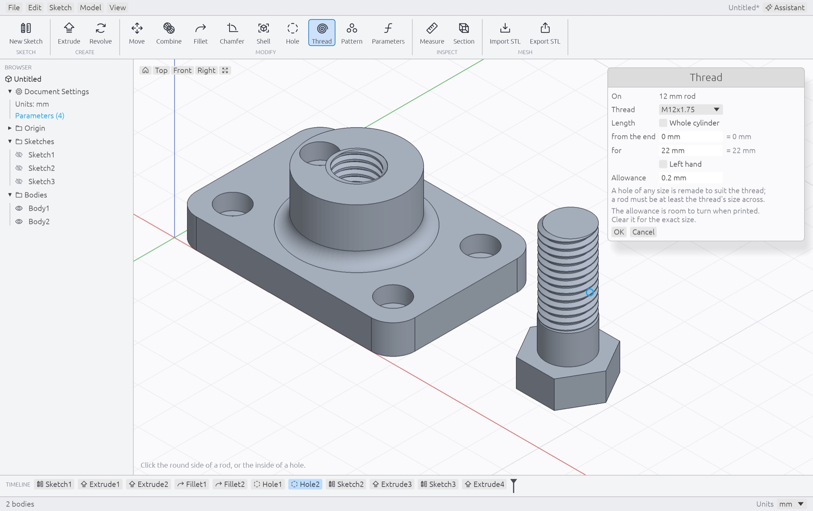
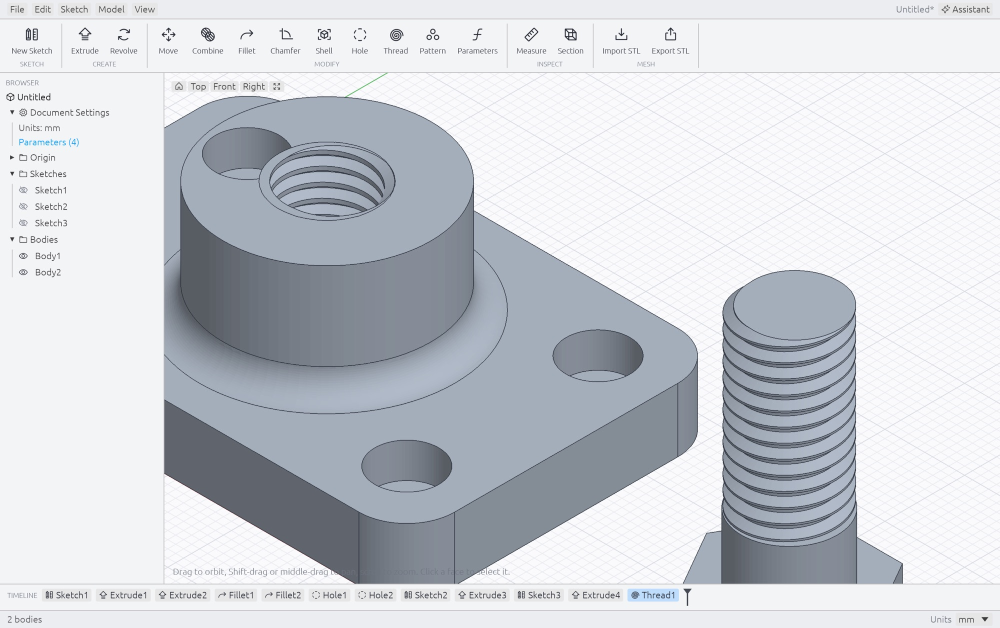
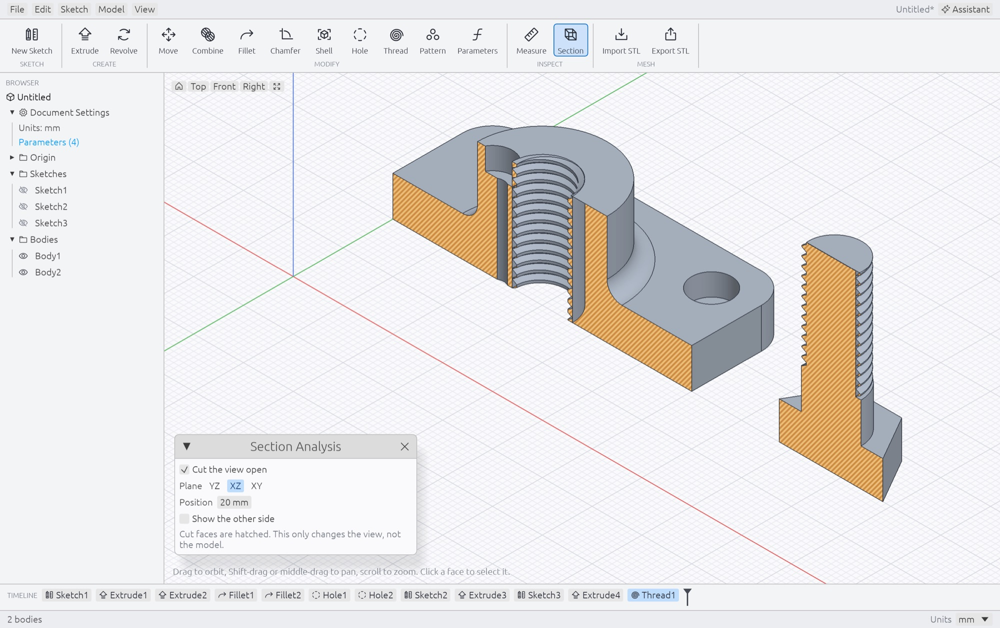
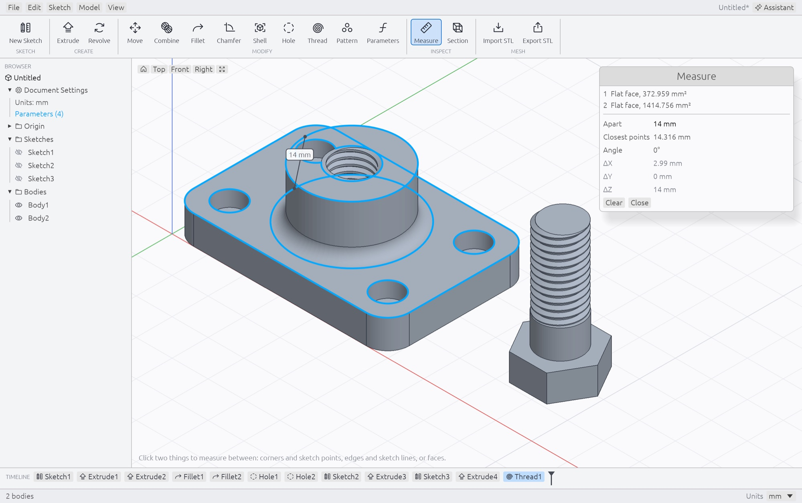

<h1 align="center">Ferrender</h1>

<p align="center">
  <b>A parametric 3D CAD program in the manner of Fusion, written in Rust.</b><br>
  Constrained sketches, exact solids, a timeline you can go back and edit, real screw threads,<br>
  and every operation a JSON command that Claude can drive.
</p>

<p align="center">
  
  
  
  
  
</p>

<br>

<p align="center">
  
  <br>
  <sub>A block with a tapped M12 bore and the bolt that goes in it. Twelve features, all still editable in the timeline along the bottom.</sub>
</p>

<p align="center">
  <a href="#sketch-with-intent">Sketching</a> ·
  <a href="#from-sketch-to-solid">Solids</a> ·
  <a href="#holes-and-threads-from-a-catalog">Holes &amp; threads</a> ·
  <a href="#look-inside-and-measure">Inspect</a> ·
  <a href="#built-to-be-driven">AI</a> ·
  <a href="#get-started">Get started</a> ·
  <a href="#reference">Reference</a>
</p>

<br>

<table>
  <tr>
    <td width="25%" valign="top">
      <h3>Parametric</h3>
      Sizes are expressions. Name one <code>w</code>, use <code>w / 2</code> somewhere else, change it later and everything built on it follows.
    </td>
    <td width="25%" valign="top">
      <h3>Exact solids</h3>
      Bodies are true planes, cylinders and blends from the OpenCascade kernel, so they fillet, shell and export to STEP. Triangles are only for the screen and for STL.
    </td>
    <td width="25%" valign="top">
      <h3>Made for printing</h3>
      Holes sized for a screw from a thread catalog, and threads modeled for real, on a hole or on a rod, ready for the slicer.
    </td>
    <td width="25%" valign="top">
      <h3>AI native</h3>
      The buttons, the MCP server and the built-in assistant all run the same JSON commands. Claude builds in the window you are looking at.
    </td>
  </tr>
</table>

<br>

Every screenshot here is the real app, driven and rendered offscreen by the test harness in
[`demo.rs`](crates/ferrender/src/demo.rs). The part is built from scratch each time the pictures are made.

## Sketch with intent

<table>
  <tr>
    <td width="50%" valign="top">
      
      <br>
      <sub>The one sketch behind the block. Every <code>fx:</code> is a formula: the circle sits at <code>w / 2</code>, <code>d / 2</code>.</sub>
      <h3>Dimensions that are formulas</h3>
      Draw roughly, then say what you mean: horizontal, tangent, equal, 30 from that edge. The status bar counts the freedom left and confirms when the sketch is fully constrained. Position dimensions and geometric constraints preserve your intent; a conflicting edit is refused.
    </td>
    <td width="50%" valign="top">
      
      <br>
      <sub>Mid-rectangle: the width is held at a new parameter, the height is being typed in inches.</sub>
      <h3>Type sizes as you draw</h3>
      After the first click, boxes appear for the width and height, the diameter or the length. Type a size and it holds while the pointer picks the direction; Tab goes to the next box. <code>w = 48</code> names a parameter on the spot, and any unit works in any document.
    </td>
  </tr>
</table>

## From sketch to solid

<table>
  <tr>
    <td width="50%" valign="top">
      
      <br>
      <sub>Extrude by <code>$t</code>. The arrow can be dragged instead; it lands on round numbers.</sub>
      <h3>Pull it up</h3>
      Extrude and Revolve work on the closed regions of a sketch or straight on a flat face. Make a new body, or join, cut or intersect the ones it meets. Go a distance, through everything, or up to a face you click.
    </td>
    <td width="50%" valign="top">
      
      <br>
      <sub>Click an edge, type a radius, and the preview is the real result.</sub>
      <h3>Round it off</h3>
      Fillet, chamfer and shell work on the exact solid, so a blend is a true surface. A size that cannot fit is refused in the preview, before you press OK.
    </td>
  </tr>
</table>

Every feature lands in the timeline at the bottom. Double-click one to change it, or drag the marker back to see the
part as it was and slot a new feature in at that point.

## Holes and threads from a catalog

<table>
  <tr>
    <td width="50%" valign="top">
      
      <br>
      <sub>Four clicks, four holes. The sizes come from the M4 row of the catalog.</sub>
      <h3>Holes that know their screw</h3>
      Pick the screw, not the drill: a clearance hole in three fits, or a tapped hole, plain, counterbored for a socket cap or countersunk for a flat head. The catalog covers ISO metric coarse and fine from M1.6 to M12 and unified inch from #4-40 to 1/2-20.
    </td>
    <td width="50%" valign="top">
      
      <br>
      <sub>Click the side of a rod. It is recognised as 12 mm and offered M12.</sub>
      <h3>Thread anything round</h3>
      Thread goes on the outside of a rod or the inside of a hole, for all of it or a length from the end, right or left handed. A hole of the wrong size is remade to suit the thread you choose.
    </td>
  </tr>
  <tr>
    <td colspan="2" valign="top">
      
      <br>
      <sub>The finished threads, close up. These are the triangles the slicer gets.</sub>
    </td>
  </tr>
</table>

## Text and embossing

Choose **Model → Text / Emboss**, or press **S** and search for `text` or `emboss`, to make editable 3D lettering. Opening it from a sketch finishes sketch editing. Start on XY, XZ or YZ for a new body, or click a flat face on an exact body to raise or engrave a label. The clicked point is the baseline origin; X/Y offsets, angle and left/center/right alignment place the lettering. Height is the font's capital height, depth is the raised height or engraving depth, and spacing adds a gap between characters. These dimensions accept parameters and units, and the text remains editable in the timeline.

The bundled [Noto Sans Bold font](crates/fr-core/assets/fonts/PROVENANCE.txt), distributed under the [SIL Open Font License](crates/fr-core/assets/fonts/OFL.txt), makes saved designs independent of installed fonts. This first version supports one line of up to 128 characters; unsupported characters and combining marks produce a readable error. Letter counters and separate accents are preserved. Curved faces and mesh bodies are not yet supported for embossing. Lettering must fit entirely over material on the selected face. Designs containing text require this version of Ferrender; older designs remain readable.

## Look inside and measure

<table>
  <tr>
    <td width="50%" valign="top">
      
      <br>
      <sub>Section Analysis through the middle. It changes the view, not the model.</sub>
      <h3>Cut the view open</h3>
      Slide a plane through the model to check wall thickness, hole depths and how a thread actually meets its bore.
    </td>
    <td width="50%" valign="top">
      
      <br>
      <sub>Two clicks: the top of the boss and the top of the plate.</sub>
      <h3>Measure between any two things</h3>
      Corners, edges and faces, in any pairing. You get the shortest distance with its X, Y and Z parts, the angle, and for parallel things the square-on gap a drawing would show.
    </td>
  </tr>
</table>

## Built to be driven

Everything above is also a command. These are some of the commands behind the bearing block, as Claude would send
them over MCP:

```json
{"op": "set_parameter", "name": "w", "expr": "60 mm"}
{"op": "create_sketch", "plane": "XY"}
{"op": "add_geometry", "sketch": "$last_sketch", "items": [
    {"type": "rect", "from": [0, 0], "to": [55, 35]},
    {"type": "circle", "center": [25, 15], "radius": 11}]}
{"op": "add_constraint", "sketch": "$last_sketch", "kind": "distance", "refs": [4], "value": "$w"}
{"op": "extrude", "sketch": "$last_sketch", "distance": "$t", "profiles": "all"}
{"op": "fillet_edges", "body": 2, "edges": [[0, 0, 4], [60, 0, 4]], "radius": 6}
{"op": "hole", "body": 2, "at": [[8, 8, 8], [52, 8, 8]], "thread": "M4", "type": "counterbore", "through": true}
{"op": "hole", "body": 2, "at": [30, 20, 22], "thread": "M12", "fit": "tapped", "modeled": true, "through": true}
```

`ferrender mcp` is an MCP server. If a Ferrender window is open it drives that window, so you watch the part appear;
otherwise it works headless and writes files. Claude can ask for a rendered view to check its own work, and each
command is one step of undo.

```sh
claude mcp add ferrender -- /path/to/ferrender mcp
```

The Assistant panel inside the app runs the same commands through the Claude API with your own key. It has not yet
been tried against the live API.

## Everything in the box

| | |
|---|---|
| **Sketch** | Line, rectangle, circle, center/three-point/tangent arc, four-point spline, point, polygon; coordinate entry; reference images; open-end highlighting; trim, offset, mirror, fillet, chamfer; project a body's face; construction geometry; copy and paste |
| **Constrain** | Coincident, collinear, concentric, midpoint, fix, equal, parallel, perpendicular, horizontal, vertical, tangent, symmetric; signed X/Y position, length, distance, radius, diameter and angle dimensions |
| **Parameters** | Named expressions with units (`mm`, `cm`, `in`), usable in every size box |
| **Solids** | Extrude (distance, through all, to face, taper, symmetric), revolve, sweep along a path, box, cylinder, sphere, cone/frustum, torus; join / cut / intersect, fillet, chamfer, shell |
| **Text** | Editable 3D lettering, raised text and engraving on flat exact faces, alignment, offsets, rotation, spacing and parameter-driven dimensions |
| **Holes and threads** | Simple, counterbore, countersink; clearance or tapped from the catalog; modeled threads inside and out |
| **Arrange** | Move, rotate, scale, combine bodies; circular, linear and mirror patterns |
| **Components (0.3 test build)** | Nested ownership, activation, scoped modeling, subtree visibility, and rigid component placement |
| **Construction planes (0.3 test build)** | Persistent Offset, Midplane, and Three Points references with attached sketches |
| **Meshes (0.4)** | STL, OBJ and 3MF import of scans with millions of triangles; repair, decimate, smooth, subdivide, cut, mirror, offset / thicken, sculpt; relief from an image; mesh booleans with closed-result checks |
| **Faces and edges (0.4)** | Picks named by how the face was made, so fillets, shells, threads, text and face planes follow upstream edits |
| **Scripts (0.4)** | Rhai scripts with declared inputs, a Scripts menu, timeline chips that re-run, `ferrender run` and `check`, six samples |
| **Inspect** | Measure, Section Analysis, degrees of freedom while sketching |
| **Timeline** | Edit, rename, suppress, delete, roll back; undo and redo |
| **Files** | `.ferr` documents, plain JSON or a container with images, meshes, a thumbnail and a geometry cache; STL, OBJ, 3MF in; STL and STEP out; recovery of unsaved work after a crash |
| **AI** | MCP server, local command socket, built-in assistant |

It is early, and smaller than what it imitates: no joints or linked component instances, no loft, no drawings, and the
[limits](#limits) below are real. `TODO.md` has the list.

## Additions in 0.4.0

**Ferrender 0.4.0** makes meshes a first-class body kind: indexed scans of millions of triangles support fast imports, BVH picking and a coarse display while orbiting, the Mesh menu edits them as timeline steps, Relief from Image turns a photo or depth map into a printable relief, and mesh booleans reject invalid inputs or results; complex scan intersections can still be refused. Faces and edges of exact bodies now carry tags saying how they were made, so fillets, shells, threads, text and face planes follow their faces through upstream edits instead of relocating by position. Designs with images or meshes save as a container with a thumbnail and an authenticated local geometry cache that can skip rebuilding. Foreign or modified supported designs rebuild, while newer unsupported files are visibly unverified previews. Rhai scripts with declared inputs run from a Scripts menu, from `ferrender run` and over MCP, and leave re-runnable chips in the timeline. See the [0.4 review](docs/releases/0.4/review.md) for measured test coverage, security boundaries and known limitations.

To walk through an exported STL in a browser or a WebXR headset, see the separate [walkthrough page](web/walkthrough/README.md).

See the [0.4.0 release notes](docs/releases/0.4/0.4.0-release-notes.md), the [manual test plan](docs/releases/0.4/test-plan.md), the [file format](docs/FILE_FORMAT.md), the [face relief tutorial](docs/tutorials/FACE_RELIEF_0.4.md) and the [0.4 plan with what shipped and what did not](docs/releases/0.4/plan.md).

## Modeling additions in 0.3.0

**Ferrender 0.3.0** adds nested components with their own sketches and bodies, scoped Join/Cut/Intersect operations, and whole-component placement and visibility. Construction planes provide persistent Offset, Midplane, and Three Points references that sketches can follow when a model changes. Native primitives add editable Box, Cylinder, Sphere, Cone and Torus features. Linear patterns support two directions for rectangular grids. It also adds Remove/Split/Join Bodies, graphical Move and primitive placement, pattern span handles, and sticky sketch capture.

Use the [0.3.0 manual test plan](docs/releases/0.3/test-plan.md) for numbered checks and the [release notes](docs/releases/0.3/0.3.0-release-notes.md) for scope and validation status. The [components specification](docs/adrs/0005-components.md) and [construction planes specification](docs/adrs/0006-construction-planes.md) describe the intended behavior and deferred work. The [primitive guide](docs/adrs/0004-solid-primitives.md) explains dimensions, origins and placement. The [direct modeling guide](docs/adrs/0007-direct-modeling.md) covers body operations, arrows/rings, graphical pattern spans and sticky sketch placement. Existing designs remain readable; files using new features require 0.3.0 or later. Check About for the exact version and source commit.

## Sketching improvements in 0.2

The 0.2 work adds **Point Coordinates…** with signed, parameter-driven X/Y dimensions, **3-Point Arc**, **Tangent Arc**, editable **four-point splines**, portable reference images with scale calibration, and **Highlight Open Ends**. See the [sketching guide and manual acceptance plan](docs/adrs/0001-sketching-tools.md) for the controls, limits, and checks. The [30 mm bishop tutorial](BISHOP_TUTORIAL.md) now uses direct coordinates and three-point arcs; its [0.1 version](docs/tutorials/BISHOP_0.1.md) is preserved.

Version 0.2.2 improves three-point arc placement, dimensions on existing geometry, persistent Shift angle locks, and direct reference-image movement and scaling. See the [0.2.2 guide and focused retest plan](docs/adrs/0002-sketching-fixes.md).

Version 0.2.1 adds **View → Appearance → System, Light, or Dark**. System follows the OS, and your selection is remembered across launches. See the [appearance guide and manual test plan](docs/adrs/0003-appearance-follows-the-system.md).

## Get started

You need a [Rust toolchain](https://rustup.rs) and a C++ compiler (Xcode's clang, or g++).

```sh
export OCCT_ROOT="$(python3 scripts/prepare-occt.py)"   # verified OpenCascade, once per shell
cargo run --release -p ferrender                # empty design
cargo run --release -p ferrender -- part.ferr   # or an .stl to import
./scripts/bundle-macos.sh                       # dist/Ferrender.app
```

The solid kernel is OpenCascade. There is no cmake step: `scripts/prepare-occt.py` (Python 3.12+) downloads the
`cadrum` binding's prebuilt OpenCascade 8 static libraries the first time (about 33 MB, from that project's GitHub
releases) and checks them against the SHA256 pinned in `scripts/occt-pins.json`. Release builds refuse to compile
without it, and Help → About and `--version` show the result on the `OpenCascade:` line. Debug builds, and release
builds with `FERRENDER_ALLOW_UNVERIFIED_OCCT=1` (needed on platforms without a pinned archive), may use cadrum's
own unchecked download; they are marked `unverified` and cannot be packaged.

**Linux** needs the usual winit and wgpu system packages (X11 or Wayland development libraries and a Vulkan or GL
driver). CI builds and tests on Ubuntu 24.04 with software Vulkan; a native Linux desktop session has not been manually checked.

## Under the hood

- **`crates/fr-core`**: the engine, with no GUI dependency. Expressions and units, sketches, the constraint solver,
  profile detection, exact solids (`exact.rs`, OpenCascade through cadrum) with a mesh fallback, the thread catalog
  and generator, STL and STEP, the document and its undo history, the command API, and a software renderer for
  windowless screenshots.
- **`crates/ferrender`**: the app, built on [egui](https://github.com/emilk/egui) and eframe and drawn with wgpu,
  plus the MCP server and the assistant.

```sh
cargo test          # engine tests, plus UI tests that drive the real app offscreen and write frames to target/uitest/
```

The README screenshots come from the same harness:

```sh
./scripts/readme-images.sh    # runs the ignored readme_ tests and writes docs/images/
```

Use **Help → About Ferrender** to see the version, full source commit, whether local changes were included, and the build/platform. **Copy build info** copies those details for a test report. The same information is available with `ferrender --version`; it is embedded in the executable at build time. Source archives without Git history report the commit as unavailable.

## Reference

### Command search and Move

Press **S** to search available commands, type a name such as `torus` or `text`, then use the arrow keys and **Enter** to run it. **Escape** closes search. **M** opens Move for the selected body or component. These letter shortcuts do not fire while typing into an input.

### Sketch

New Sketch, pick a plane (or click a flat face of a body). Line
(L), Rectangle (R), Circle (C), Arc (A), Point (P). Clicks snap to existing
points and onto lines and curves; a nearly horizontal or vertical line becomes
exactly so. **3-Point Arc** uses start, end, then through/bulge points; **Tangent Arc**
continues from a line or arc endpoint. **Spline** passes through four editable
fit points. **Point Coordinates…** creates a point or edits a selected one
with signed X/Y expressions; double-click a point to reopen it. Position
dimensions keep the coordinates attached to parameters. Drag with Select (V);
geometry moves as far as its constraints allow. While drawing a line, **Shift**
freezes its current direction; for a tangent arc it freezes the current sweep.
Hold Shift through placement to keep that angle as an editable constraint.
Line Angle, tangent-arc Sweep, and three-point-arc Diameter can also be typed
while drawing. X toggles construction geometry.

**Reference Image…** embeds a PNG or JPEG behind the active sketch for tracing,
with placement, opacity, and two-point scale calibration. With Select, drag an
empty part of the image to move it, or its selected corner handles to scale
uniformly. It contributes no
solid geometry or STL/STEP content. **Highlight Open Ends** in the Sketch
Palette marks unconnected outline endpoints; it does not repair them or
certify that a crossing or self-intersecting outline is a valid profile.

### Rework

Polygon draws a regular polygon (set the sides in the Sketch
Palette). Project copies the outline of a body's face into the sketch, fixed
in place and drawn purple; round outlines come in as true circles. Trim (T)
removes the stretch you click, back to where other geometry crosses it. Offset
(O) makes parallel copies of the selected lines or circles at a distance that
stays a dimension. Mirror copies the selection across the line selected last
and keeps the two sides symmetric. Fillet and Chamfer round or cut the
selected corner (a point, or the two lines that meet there).

### Constrain

Select geometry, then click a constraint: coincident,
collinear, concentric, midpoint, fix, equal, parallel, perpendicular,
horizontal, vertical, tangent, symmetric. A constraint that conflicts with the
others is refused. The status bar shows the degrees of freedom left; the
sketch turns black when it is fully constrained.

### Dimension (D)

Select an existing line, circle, arc, or dimension label, then press **D** to
enter or edit its size. Alternatively, choose Dimension first and click the
item. A line opens its length immediately; a circle uses diameter and an arc
uses radius. To dimension between two items, Shift-select both before pressing
D: two points or parallel lines give distance, two other lines give angle,
and a point plus a line gives perpendicular distance. Double-click a dimension
to change it. An existing radius or diameter is reopened instead of adding a
competing size constraint.

### Values

Every size box takes an expression:

| You type | Meaning |
|---|---|
| `10` | 10 of the document's units |
| `10 mm`, `2.5 cm`, `1 in`, `1"` | a length in those units, whatever the document's are |
| `$w / 2 + 1 mm` | arithmetic with parameters (`w / 2` works too) |
| `w = 60 mm` | defines the parameter `w` and uses it here |
| `90 deg`, `1.57 rad` | angles |
| `1e-6 mm`, `-2.5E+1 mm` | finite values in scientific notation |

Parameters are also listed and edited under Parameters. Changing one rebuilds
everything that uses it. Bare numbers are stored with the units they were
typed in, so switching the document between mm, cm and in changes how sizes
are shown, not how big anything is.

### Model

Extrude (E), Revolve and Sweep work on closed sketch profiles. A sketch with one
closed region selects it automatically; with multiple regions, click the one
you want. A normal click replaces the selection; Shift-click adds or removes
regions. This also applies after projecting a face: its outline remains usable
geometry, but is never silently included with a new circle. A profile nested in another is
a hole in it. Each can make a new body, or join, cut or intersect the bodies
it touches. Double-click a feature in the timeline to edit it. Extrude can
be set by dragging the arrow that stands on the profile or face (it lands
on round numbers; pull it back through the plane to go the other way). It can
also go Through All bodies, reach To Face (click a face and the distance is
measured for you), and lean its walls with a Taper angle. New Sketch takes an
Offset, for a sketch on a plane above or below the one you pick.

Sweep carries a profile along a path drawn in another sketch: a handle, a
pipe run, a gasket, a picture frame. Draw the path first (lines, arcs and
splines joined end to end, or one circle), then the profile on a plane that
crosses it. Model → Sweep picks the newest closed region as the profile and
the newest other sketch that is one run as the path; click a region or a curve
in the viewport to change either, and Shift-click curves to follow only part
of a sketch. Pieces that meet tangentially are followed exactly. A sharp
corner is mitred, as on a picture frame, and may turn by up to 150 degrees. A
closed path gives a ring or a frame. The profile may sit anywhere along the
path and off to one side of it. Follow path turns the profile with the path;
Fixed keeps the orientation it was drawn in. Along path limits the sweep to
parts of the path: drag the handles on the track, or type the fractions, where
0 is the start of the path and 1 its end. Add part sweeps another stretch as
well, so 0.1 to 0.3 and 0.6 to 0.7 gives two separate pieces in one body. Each
piece is the part of the whole sweep that lies there, so shortening a sweep
never moves what is left. Parts that touch or overlap are joined. A sweep is refused with the
reason when a bend is tighter than the profile reaches on its inside, when a
stretch between two corners is too short for the mitres, or when the kernel's
result does not have the volume the sweep must have. The path must lie in one
sketch plane, so a helix or a path that leaves its plane is not possible yet,
and the profile cannot twist or change size along the way.

### Primitives (0.3 test build)

Choose **Model → Primitives → Box, Cylinder, Sphere, Cone or Torus**, or use the **Primitive** toolbar button. Set dimensions, position, optional rotation, and New Body / Join / Cut / Intersect. Dimensions and placement accept units and named parameters. Place in view chooses a position on an origin plane, flat face or construction plane; optional alignment and colored arrows/rings refine it. Placement captures numeric values once. Double-click the timeline feature to edit it; no sketch is required.

Position is the box's minimum corner, the cylinder/cone base center, or the sphere/torus center. Height follows +Z before rotation. Rotation runs X, then Y, then Z about that origin; position and rotation use the owning component's axes. A cone with two nonzero diameters is a frustum; a zero diameter creates a tip. For a torus, Major radius reaches the tube's center, and Tube radius sizes its cross-section. The [primitive guide](docs/adrs/0004-solid-primitives.md) includes examples and limits.

These are exact solids that support subsequent sketches, fillets, holes, transforms, patterns, Combine and STEP export. New Body is the default, so touching primitives stay separate until you choose Join or Combine.

### Faces and edges

Faces of exact bodies carry identities based on sketch entities, primitive roles,
source faces and the boundaries of split pieces. Fillets, chamfers, shells,
threads, text and face planes use these identities through upstream edits.
Pattern copies stay distinct and kernel face order is not an identity. A removed
or ambiguous reference reports an error instead of choosing an unrelated face.
`get_object_info` lists these tags and how picks resolved. Old files learn modern
tags when the saved pick uniquely identifies its original face. Geometry without
unique provenance uses a conservative signature and may need reselection after
its shape changes; see the [review](docs/releases/0.4/review.md) for the remaining limits.

### Exact and mesh bodies

An untapered sketch extrusion, revolve, sweep or primitive creates an exact solid: true
planes, cylinders and blends, turned into triangles only for display and STL.
An imported mesh, a tapered extrude, and anything combined with one of those is
a mesh body. Both kinds work with extrude, revolve, cut, join, move and
pattern. Only exact bodies can be filleted, chamfered, shelled or written to
STEP. The status bar says which kind the selected body is.

### Components (0.3 test build)

Choose **Model → New Component**, name the part, and build its sketches and bodies while it is active. The browser shows the hierarchy and the status bar identifies the active component. **Activate Root** returns to the document level. Join, Cut, Intersect, and Through All stay within the feature's component; use Combine explicitly to work across components.

Select a component node and choose Move to translate or rotate its whole subtree. Select a body instead to add an ordinary body Transform feature. Hide a component to hide its descendants. Each feature keeps its owner in the single document timeline; rolling back before a component's creation makes it unavailable and returns activation to root.

### Construction planes (0.3 test build)

Choose **Model → Construction Plane** or the **Plane** toolbar button. Offset keeps a signed distance from an origin plane, a flat face, or another construction plane. Midplane sits halfway between parallel faces or bisects intersecting faces; Flip chooses the other angular bisector. Three Points uses picked vertices, sketch points, or entered coordinates. Typed point coordinates use the owning component's axes.

Start New Sketch on a construction plane to keep a persistent attachment. Editing the plane or its references updates the sketch and its dependent solid features. A one-time Offset in New Sketch remains a separate shortcut that copies a plane without establishing that relationship. Planes appear under Construction, can be hidden or edited, and contribute no solid geometry to STL or STEP.

### Fillet, Chamfer, Shell

Fillet and Chamfer round or bevel the edges of a
body: click edges to add or remove them (with a face selected first, its edges
start selected). Shell hollows a body to a wall thickness, open at the faces
you click. A size that cannot fit is refused in the preview.

### Timeline

Features sit in the order they were made. Double-click one to
edit it; right-click for rename, suppress and delete. Drag the marker at the
end of the timeline to the left to roll the model back in time: features after
it are not built, and new features go in where the marker is. "Roll to End"
brings everything back. While dragging, only the marker moves; the model stays
at its current history position. Release to rebuild once, or press Escape to
cancel. Dragging is disabled until the updated view finishes drawing.

### Pattern

Repeats an extrude, revolve, sweep, primitive, standalone text or imported mesh: around an axis,
in a row or rectangular grid, or mirrored through an origin plane. Axes belong
to the source component. For four corners choose Linear, Count 2, and enable
Second direction with Count 2 on another axis. Enter the distance between corner
centers for each spacing; a negative value reverses that direction. Counts
include the original, with at most 1000 positions in a grid. Double-click the
pattern's timeline chip to edit both directions together. Drag a last-copy span handle to set each direction graphically; capture a sketch target to align that axis coordinate. This sets a numeric spacing, preserving other coordinates. A patterned cut cuts again at
each position; a patterned body makes more bodies. Dots in the viewport show
where each copy will land. A cut copy that lands clear of every body is
skipped; if they all miss, try another axis or a negative spacing.

### Hole

Click a flat face to put holes on it (a visible sketch point under
the cursor places one exactly). A hole is simple, counterbored or countersunk,
and sized either by a diameter or for a screw from the thread catalog: a
clearance hole (close, normal or loose fit) or a tapped hole. Counterbores fit
a socket cap screw and countersinks a flat head screw of that size unless you
type your own. A tapped hole is left at the tap drill size, to be tapped or
for a screw to cut its own thread; tick "Model it" to have the real thread,
for printing. "Allowance" widens every diameter, the modeled thread's
included; ticking "Model it" fills in 0.2 mm.

### Thread

Click the side of a rod or the inside of a hole to put a real
thread on it. It suggests the size the cylinder was made for, so a 6.6 mm M6
clearance hole is offered M6. A hole of any size is remade to suit the thread
you choose (filled in and re-drilled if it is too wide), and a rod wider than
the thread is turned down to it; a rod thinner than the thread is refused.
It can run the whole cylinder or a length measured from its outer end, right
or left handed.

At a free end, the first turn tapers from the root to the crest so the screw
can start in its mating hole. If the rod was chamfered before threading,
Ferrender also trims that end chamfer below the thread root. This avoids
leaving an oversized, unthreaded collar that blocks the screw from entering.
An offset or partial thread leaves ends outside its span untouched.

**Allowance** is the room a thread needs to turn. A hole's thread is made
that much wider across and a rod's that much thinner. The dialog starts at
0.2 mm, so a printed screw and a printed hole have 0.4 mm of diametral
clearance (0.2 mm radially), and a metal screw has 0.2 mm of diametral
clearance in a printed hole. Clear the box for the exact size:
two printed threads at exact sizes will not go together. Printers differ, so
treat 0.2 mm as a starting point. Threads finer than about M4 are at the edge
of what a 0.4 mm nozzle can form; for those a tapped hole left unmodeled, for
a metal screw to cut its own thread, is usually the better choice.

The catalog (`fr-core/src/threads.rs`) holds ISO metric coarse and fine from
M1.6 to M12 and unified inch from #4-40 to 1/2-20, each with its pitch, tap
drill, clearance holes, counterbore and countersink. `list_threads` returns it.

### Sizes while drawing

Once the first point of a rectangle, circle or line
is down, boxes appear for its width and height, diameter, or length. Type a
size and it holds whatever the pointer does (the pointer still picks the side
or direction); Tab moves to the next box; Enter or a click places the shape.
Each size typed becomes a dimension on it, and `w = 20` defines a parameter
as it does anywhere else. Enter with nothing typed ends a line as before.

### Measure (I)

Click two things: corners and sketch points, edges and sketch
lines, or faces. It gives the distance between them with its X, Y and Z
parts, the angle between straight or flat ones, and for parallel ones how far
apart they are square to each other, which is the figure a drawing would
show. Clicking a hole or a rod's side shows its diameter. The `measure`
command does the same for Claude.

### Section Analysis

Cuts the view open along a plane you can slide, with the
cut faces hatched, to check walls and holes. It changes the view only.

### Faces

Clicking a body selects the face under the pointer (the patch the
viewport outlines); the whole body is selected from the browser. With a flat
face selected, Extrude pulls it out, or pushes it in and cuts with a negative
distance, and New Sketch starts a sketch on it. You can also click a face
inside the Extrude dialog.

### Move

Move, rotate and scale act on the selected body, or on the body a
selected face belongs to. Type distances, or drag the body to slide it across
the screen (from the Top view that is X and Y). Enter confirms.

### Copy and paste

In a sketch, ⌘C / ⌘X / ⌘V (Ctrl on Linux) copy the
selected points and entities with the constraints and dimensions between them.
Paste lands under the pointer. The clipboard holds plain JSON, so it also
works between Ferrender windows.

### Meshes

Import Mesh reads STL (binary or ASCII), OBJ and 3MF and brings the mesh in
as a body, streaming the file and sharing vertices as it goes, so scans of
millions of triangles import in a few seconds and stay quick to orbit and
pick. On import the mesh is repaired (degenerate and duplicate triangles
dropped, neighbouring triangles turned to agree, closed shells turned
outward) and the toast reports shells, open edges and non-manifold edges.
Bodies above two million triangles draw a coarse copy while the view moves.
Bodies can be moved, rotated and scaled, combined with each other, sketched
on and cut. The Mesh menu edits meshes as timeline steps: Repair (with hole
filling), Decimate (quadric, or clustering for huge scans), Smooth (Taubin, no
shrink), Subdivide (Loop or midpoint), Cut by a plane (capped, one side or
both), Mirror, and Offset / Thicken, which turns an open surface such as a
relief into a closed printable solid or hollows a closed one to a wall. Relief
from Image builds a height field from a photo or a depth map, bright pixels
high, on a slab; inverted and thin it is a lithophane. Sculpt opens a brush
(pull, push, inflate, smooth, flatten) and every click on the body adds one
stroke to the timeline. Applying a mesh operation to an exact body makes it
a mesh. Mesh Booleans use Manifold with an exact rational fallback for difficult
intersections. Results are checked again after conversion to the stored mesh
precision. Work and triangle limits produce an error instead of a partial result.
Over the command API the same
operations take regions (a sphere, box, plane side, normal cone or connected
shell) and `mesh_measure` reports shells, open edges, watertightness, volume
and wall thickness. Export STL asks whether to write millimetres, centimetres or inches;
slicers read STL as millimetres. Export STEP writes the exact bodies as true
surfaces for other CAD programs; mesh bodies are left out.

### Scripts

The Scripts menu runs Rhai scripts against the open design. A script is a text
file with a `META` map (name, description, declared inputs) and a `fn
run(inputs)`; every command of the API is a function in it, so `extrude(#{
sketch: s, distance: inputs.expr.height })` does what the MCP command does. An
inputs dialog is made from the declared inputs (lengths and angles take
expressions, so parameters stay live) and remembers what you typed. Runs go on
a worker thread with a progress bar and Cancel, land as one undo step, and
leave a chip in the timeline that owns what the run made: Edit Inputs and
Re-run, Re-run, Detach, Suppress and Delete act on the whole run. A script's
`confirm` and `ask` appear as questions in the progress window. Cancel stops
the script at its next step; a modeling call already under way cannot be
interrupted, so after a moment the window offers to stop waiting and discard
the result when that call ends. Scripts can read and write files only in
their own folder, the design's folder and folders you allow in `config.toml`;
resolved paths must remain inside those folders, with link-resistant access on
macOS and Linux. Files a script writes (saves,
exports, screenshots, text and CSV) are staged beside their targets and moved
into place only when the run succeeds. Ordinary cancellation and save failures
restore the previous files. A crash or storage failure during rollback can
require recovery; the error lists retained recovery files. Undo does not remove
files a finished run wrote. Samples (export variants of a parameter, export a
folder of designs, a spur gear, bosses at sketch points, a CI check, the face
relief) can be copied to your scripts folder (`~/.config/ferrender/scripts`)
and edited; Export Timeline as Script turns the open design into a script with
its parameters as inputs (large imported meshes and images go in files beside
the script, named by content to avoid overwriting older assets; a failed feature
is exported suppressed, and a timeline marker is
put back where it was). Headless, `ferrender run script.rhai design.ferr
--input teeth=24 --save` runs a script and `ferrender check design.ferr` lists
timeline errors for CI; over MCP, `list_scripts` and `run_script` do the same.

Give outputs stable keys when a script can reorder or repeat modeling commands:
`primitive(#{output_key: "left-boss", type: "box", width: 10, depth: 10, height: 10});`.
A later feature keeps addressing `left-boss` even when another output is inserted
before it. In loops, derive the key from the source item identity, such as a sketch
point ID, not the iteration number. An explicit unique name also identifies an
output; otherwise an unchanged source and call site are used. Repeated unkeyed
modeling calls are refused with guidance. Older unkeyed ScriptRuns with later
features must be detached or rebuilt deliberately; reruns never guess by order.

### View

In the model, drag to orbit and Shift-drag to pan. In a sketch the
left button belongs to the tools, so orbit with a right-drag (or Alt-drag) and
pan with a middle-drag or Space-drag; those work in the model too. The wheel
zooms. On a trackpad, two fingers pan (with Shift, orbit) and pinch zooms. F
fits everything.

### AI

`ferrender mcp` is an MCP server on stdin/stdout in the shape of the Blender MCP:

| Tool | |
|---|---|
| `get_reference` | the full command list with arguments |
| `get_scene_info` | units, parameters, the feature timeline with any errors, bodies |
| `get_object_info` | one sketch (points, entities, constraints, profiles), feature or body |
| `get_viewport_screenshot` | a rendered image from a named view or the app's camera |
| `execute_ferrender_commands` | a list of JSON commands, each one an undo step |

On macOS and Linux it drives the running Ferrender window over a private
Unix socket, so you watch the model change. The socket lives in a mode-0700
`bridge` directory beside the settings and accepts clients running as your
OS user; there is no TCP listener. Those clients can modify the document and
write files with your permissions. Disable this access in the Assistant panel
or with `[bridge] enabled = false`, then restart the app.

If no window is available when the first command runs, or with `--headless`,
MCP selects a separate document and writes files with `save` and `export_stl`.
That backend stays selected for the entire MCP session. Losing a connection
returns an error rather than changing documents or replaying a command, and
a restarted app has a new identity: restart the MCP client to select it.
`--port N` is retained as the socket channel selector (default 47821), not a
network port. Other platforms currently support only explicit `--headless`.
For Claude Code:

```sh
claude mcp add ferrender -- /path/to/ferrender mcp
```

The commands are documented in `crates/fr-core/src/api.rs` (`REFERENCE`),
which is also what the tools tell the client.

The Assistant panel in the app does the same from inside, using the Claude
API. It needs `ANTHROPIC_API_KEY` in the environment, or a key pasted into the
panel, which is saved to the config file.

### Files

The native format is `.ferr`: a JSON document holding the units, parameters and
the feature timeline, with every sketch's points, entities, constraints and
dimension expressions. The source timeline remains authoritative. A geometry
cache can skip rebuilding on the same installation: saved containers are
authenticated with a private local key. Unsigned, foreign or changed caches are
discarded and supported designs rebuild. Newer unsupported files are explicitly
unverified read-only previews, including when their saved geometry is exported.
A design that carries reference images or imported meshes is
saved as a ZIP container instead (since 0.4): the same JSON as `design.json`,
each image and mesh as its own entry, a `manifest.json` and a `thumbnail.png`.
Plain designs stay plain JSON, so they diff in git and open in older builds.
Every earlier `.ferr` opens unchanged; the first time a design with images or
meshes is saved by 0.4, the old file is kept beside it as `name (0.3 backup).ferr`.
Files that use features an older build lacks are refused by it with a message;
[docs/FILE_FORMAT.md](docs/FILE_FORMAT.md) describes both forms and the version
table.

Unsaved changes are copied, about a second after each one, to a `recovery`
folder beside the settings. The copy is removed when you save and when the app
closes normally. If the app crashed or was killed, the next start lists what
was left and offers to recover or delete it; **File › Recover Unsaved…** shows
the list again. Recovery never writes over your own `.ferr` file: a recovered
design opens unsaved, under its old name, until you save it.

**File → Open Recent** remembers the last 12 successfully opened or saved designs,
newest first, across app restarts. Folder labels distinguish identical filenames;
hover an entry for its full path. Opening a recent design uses the normal
unsaved-work prompt. Missing or unreadable designs show an error and keep the
current document. **Clear Recent** empties the list without deleting files.
History is stored privately in `recent.json` beside the settings; imports,
exports, failed operations, and separate headless automation do not populate it.

Settings live in `~/.config/ferrender/config.toml` (`$XDG_CONFIG_HOME` and
`FERRENDER_CONFIG_DIR` are honoured), written with mode 0600:

```toml
[ai]
api_key = ""   # Anthropic key; ANTHROPIC_API_KEY wins
model = ""     # empty = claude-opus-5-5

[bridge]
enabled = true # allow same-user MCP clients; restart the app after changing
port = 47821   # private socket channel for `ferrender mcp`, not a TCP port
```

## Limits

- Fillets, chamfers and shells find their edges and faces again by position
  each time the model rebuilds (where they were, or the same place within the
  body's bounds). They survive a body changing size, but an earlier feature
  that reshapes that area can lose them; the feature then fails with a message.
- The kernel binding is young: `cadrum` 0.8, one maintainer, pinned to an
  exact version. OpenCascade can return a wrong shape without an error, so
  every operation is checked against what it must do to the volume or bounds;
  a failed check is reported as an error, not shown.
- OpenCascade is LGPL-2.1 with an exception and is linked statically. A
  closed-source distribution would have to let recipients relink it.
- A modeled thread is a closed shell of its own that overlaps the body by
  0.05 mm, not a cut into it. OpenCascade took seconds per thread, failed on
  long ones and sometimes returned an empty solid, so the thread is generated
  directly as triangles. Slicers join overlapping shells; a mesh checker may
  report them as intersecting. The body stays exact, so it can still be
  filleted; STEP shows a plain hole or rod; a later cut through the thread
  does not cut the thread; and a body's reported volume leaves threads out.
- Thread sizes follow the basic ISO and unified profile. The allowance moves
  the whole profile in or out; there are no tolerance classes such as 6g and
  6H, and the 0.2 mm default comes from general printing practice, not from
  measured prints. The catalog's tap drill and clearance sizes were entered from
  memory of the standard tables and have not been checked against them.
- Holes start on flat faces and stay where they were put; they do not follow
  the face if an earlier feature moves it. A thread that runs through a hole
  ends square at the depth where the hole's axis leaves the body.
- Mesh Booleans accept up to 8 million input triangles combined, with candidate,
  output and time budgets. Invalid or unrepresentable results are refused. Mesh
  bodies have no exact fillets or Thread (Hole works on them).
- Sketch regions are found from shapes that share points. Two shapes that
  merely cross are not split where they cross.
- A sketch on a body's face, a projected outline and an extruded face record
  where the face was; they do not follow it if an earlier feature moves it.
- Offset does not handle arcs. Pattern axes and mirror planes use the source
  component's frame, through its origin. Section view needs the GPU viewport and does not
  affect picking.
- The spline tool uses four fit points. Arbitrary fit-point counts, periodic
  spline editing and spline tangent constraints are not available. Radius, Equal,
  Offset, and Trim also do not support splines; Trim refuses sketches containing
  them because spline intersections are not implemented. Tangent Arc starts
  from a line or circular arc.
- Reference images are limited to 8 MiB of source data, 4,194,304 pixels, and
  8192 pixels per side. Calibration adjusts uniform scale; it cannot undo
  photographic perspective distortion.
- Not built yet: helix and other paths that leave one sketch plane, sweeps that twist or scale, loft, sphere primitives, draft, and
  copying a whole body. See `TODO.md`.

## Credits

Solids come from [OpenCascade](https://dev.opencascade.org/) through the [cadrum](https://crates.io/crates/cadrum)
binding. Ferrender is an independent project. It is not affiliated with or endorsed by Autodesk, and "Fusion" is
their trademark.
