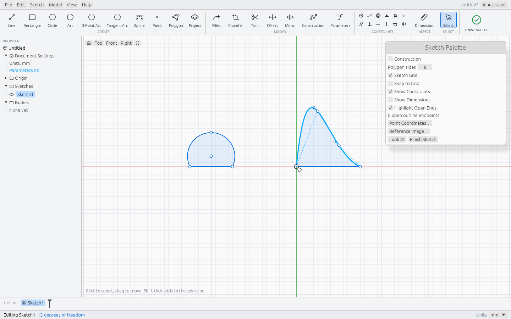
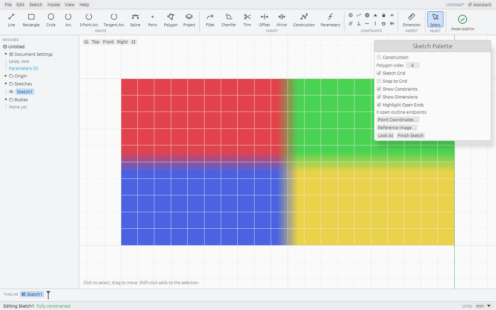

# ADR 0001: Sketching tools: coordinates, arcs, splines and reference images

| | |
|---|---|
| **Status** | Accepted; shipped in 0.2.0 and refined in 0.2.2 |
| **Date** | 2026-10-07 |
| **Related** | [ADR 0002](0002-sketching-fixes.md) refines it |

## Context

Ferrender 0.1 sketches were lines, rectangles and circles placed by clicking, with dimensions typed afterwards. Tracing a real object, as the bishop tutorial does from a photograph, needed exact coordinates, arcs that pass through chosen points, free curves, and a picture to draw over. Open outlines failed silently when a profile was asked for.

## Decision

Point coordinates are signed, parameter-driven position dimensions rather than one-off placements. Arcs come as centre-start-end, three-point and tangent arcs, with persistent tangent constraints. Free curves are interpolating B-splines through exactly four editable fit points. A sketch may carry a reference image with a two-point calibration, scale and opacity. Open ends are ringed, and directions snap with explicit angle locks. Each behaviour has a manual acceptance plan in the record.

## Consequences

Exact solids can be modelled from traced profiles, and every placement remains editable through the solver. The four-point spline is a known limit: longer curves are chains of splines that are not tangent at their joints, which the 0.5 modeling plan takes up. Later releases kept these tools and changed only shortcuts (Select on V, command search on S in 0.3.0).

---

## Original document

The design document as written for the release, kept in full. Headings are demoted one level; links were updated when the documents were reorganised on 9 October 2026.

## Sketching in Ferrender 0.2

For 0.3.0, Select uses **V**; **S** opens command search. Other steps below retain their documented 0.2.2 behavior.

This guide covers Ferrender **0.2.2** and includes a manual acceptance plan. For a shorter retest of the 0.2.2 changes, see [Sketching fixes in 0.2.2](0002-sketching-fixes.md). A test listed below is a check to perform, not a claim that someone has already performed it. See the release notes for completed validation.

The new tools help you place a profile accurately, trace a photograph, and find open ends before making a solid. The [30 mm bishop tutorial](../../BISHOP_TUTORIAL.md) uses direct coordinates and three-point arcs from a blank document. The [older tutorial](../tutorials/BISHOP_0.1.md) remains available for 0.1 builds.

### Point coordinates and position dimensions

While editing a sketch, choose **Sketch → Point Coordinates…** or the matching button in the Sketch Palette. With no point selected, enter **X** and **Y**, then click **Place Point**. The dialog stays open for repeated entry. **New Point** switches back to creation and resets the fields to zero.

To edit an existing point, select it before opening the dialog, or double-click it. Edit the values and choose **Apply Coordinates**. The dialog closes after the edit. X and Y are the sketch's own axes, measured from its origin. For an XZ sketch, X is world X and sketch Y is world Z; a negative Y therefore lies below the origin.

Both fields accept signed length expressions, for example `-4 mm`, `0.25 in`, or `$width / 2`. Ferrender records position dimensions, so a parameter change can move the point and attached geometry. Entering the new coordinates updates the existing position dimensions rather than stacking another pair on the point.

A point with both coordinates dimensioned will resist dragging. Edit the coordinates or remove the relevant constraint if you want that direction to be free. Other constraints still apply; incompatible values must be refused without leaving a partial edit. The sketch origin is fixed and cannot be moved this way.

### Dimensions on existing geometry

Draw roughly, then select a line and press **D** or choose **Dimension** to enter its length. You can also choose Dimension first and click the line; the value box now opens immediately. A circle defaults to diameter and an arc to radius. If the curve already has a radius or diameter dimension, Ferrender reopens that value instead of adding a competing dimension. Press Enter to accept a value; double-click its label to edit it later.

For a dimension between two items, use Select and **Shift-click both items before pressing D**. Two points give distance; a point and a line give perpendicular distance; two parallel lines give spacing; two other lines give angle. In the Dimension tool you can still click a point and then another point or line. Because a first line click now opens its length immediately, use the preselection method for two-line dimensions.

Length dimensions change geometry only as its other constraints allow. A line whose endpoints already have fixed X/Y coordinates may refuse an incompatible length. Edit those coordinates or remove an unwanted constraint first.

### Sticky directions and explicit angle locks

While drawing a line, nearby horizontal, vertical, 45°, parallel, perpendicular, and endpoint-tangent directions can snap gently. Tangent arcs also snap near 45° sweep increments. Move farther away to leave an ordinary snap.

Hold **Shift** to freeze the line's current direction or a tangent arc's current sweep. Moving the pointer then changes the line length or arc size. Keep Shift held through placement to retain the angle as an editable dimension. Releasing Shift before placement releases the explicit lock. Shift still adds to a selection when using Select.

You can type a line's **Length** and **Angle**, or a tangent arc's **Sweep**. Line Angle is measured from sketch +X and accepts zero or signed angles. Sweep must be greater than 0° and less than 360°. An explicit angle remains constrained during later edits; double-click its dimension to change it, or select that dimension and delete it to release the angle. A constraint that conflicts with existing geometry must be refused without partially adding the shape.

### Arcs

| Tool | Click order | Use |
|---|---|---|
| **Arc** (`A`) | Center, start, end | A known circle center and radius. |
| **3-Point Arc** | Start, end, through/bulge | A visible bulge or a curve whose center lies off-screen. |
| **Tangent Arc** | Existing line/arc endpoint, new end | Smooth continuation from an existing line or circular arc. |

Use **Sketch → 3-Point Arc** and click the two endpoints first, then a point on the desired bulge. After the second click, moving the pointer chooses the side and curvature while the endpoints stay in place. Snapping the last click to an existing point keeps a point-on-arc constraint, so later edits can preserve its relationship. The three distinct, non-collinear points determine which side of the circle to keep, including an arc longer than a semicircle. This remains a circular arc, not a spline. After choosing the endpoints, type **Diameter** to hold an exact circle size while choosing the side and bulge. A diameter smaller than the distance between the endpoints is impossible and is refused.

The UI click order changed in **0.2.2**: 0.2.0 and 0.2.1 used start → through → end. Existing saved arcs keep their shape. The command API still names the points `start`, `through`, and `end`; this UI change does not change their meaning.

For **Tangent Arc**, start at the endpoint of an existing line or arc, then choose the new endpoint. If several source curves share the start, select the intended source first. The new arc shares the connection point and receives a tangent constraint. A straight continuation does not define a finite-radius arc; use Line in that case. This tool's source is a line or circular arc, not a spline. Press **Escape** to abandon an unfinished gesture.

Avoid adding tangency to an already fully dimensioned outline without deciding which dimensions should be allowed to change. Smoothness can conflict with fixed endpoints and radii.

### Four-point splines

Choose **Sketch → Spline** and click four fit points in order: start, two intermediate points, end. The curve passes through all four points. They are fit points, not Bezier handles; moving one can affect more than its immediate neighborhood.

Use **Select** to drag a free fit point. Double-click a fit point to edit its coordinates numerically. Snap the endpoints to adjacent edges when the spline belongs to a closed outline. You can use a spline and closing lines to make a profile for Extrude or Revolve; the curve is kept as native spline geometry for exact modeling and STEP export.

This first tool uses exactly four fit points. You may snap the fourth point back to the first to close the curve, but that is not a periodic spline with a smoothness guarantee at the join. Neighboring fit points must be distinct. The tool is not a general editor for adding or removing arbitrary fit points, periodic splines, Bezier handle weights, or spline-to-spline tangent constraints. Four clicks alone do not guarantee a valid profile: check for crossings and close its ends with appropriate neighboring edges. Display tessellation can look segmented at high zoom even though the exact curve remains smooth. Radius, Tangent, Equal, Offset, and Trim do not support splines. Trim also refuses line or arc trimming in a sketch containing splines because spline intersections are not implemented; edit fit points or use a separate sketch instead.

### Reference images

While editing the target sketch, choose **Sketch → Reference Image…** or the Sketch Palette button, then **Choose Image…**. Import a PNG or JPEG. **Origin X** and **Origin Y** locate the lower-left corner in sketch coordinates. **Width** preserves the image proportions; **Rotation**, **Opacity**, and **Visible** control its orientation and appearance. Click **Apply** to accept the edit. Reopen the dialog for **Replace Image…** or **Remove Image**. Each accepted change is undoable; Cancel discards the pending edit.

In **Select** (`S`), drag an empty part of the image to move it. Click it to show four square corner handles, then drag a corner to scale uniformly around the opposite corner. Scaling preserves the image's proportions and rotation. Sketch points, edges, and dimension labels take priority over the image body; selected image handles take priority at its corners. Hidden references cannot be picked. Each completed drag is one undoable edit; Escape cancels a drag, and a second Escape clears the image selection. The dialog remains available for exact placement and calibration.

For scale calibration:

1. Choose **Calibrate from Two Points…**. The editor hides while you pick on the image.
2. Click the first and second landmarks. Choose well-separated points; Escape cancels the unfinished calibration.
3. In the reopened dialog, enter the **Known distance** and click **Calibrate and Apply**.

The first selected point stays in place while the image scales around it. Calibration changes uniform scale; it does not distort the image independently in X and Y. Zero-length calibration and nonpositive scale are invalid. Placement fields accept expressions when applying an edit; unlike point-coordinate dimensions, image placement is stored as the resulting values and does not follow later parameter changes. The image is displayed while editing its sketch, not as a global background in the finished model view.

The image is embedded in the `.ferr` document, so it can be reopened on a different computer without its original image file. The reference contributes no edges or solids and is absent from STL and STEP exports. Removing or hiding the reference should leave the sketch geometry unchanged.

Imports are bounded to **8 MiB of source data**, **4,194,304 pixels (4 megapixels)**, and **8192 pixels per side**. A document can embed at most **16,777,216 reference-image pixels** in total across its sketches. Resize a larger image before importing. Corrupt, unsupported, or oversized files should report an error without discarding the current sketch. These are resource limits, not a promise that every image under them will decode successfully.

A calibrated photograph is still subject to perspective, lens distortion, and uncertainty about hidden surfaces. Use measured dimensions for critical fits. For the bishop, calibrating the visible height to 30 mm sets a useful tracing scale but cannot establish every physical diameter.

### Highlight open ends

**Highlight Open Ends** in the Sketch Palette is on by default. Orange rings mark unconnected ordinary line, arc, and spline endpoints; the palette shows a count. Construction geometry and circles do not add open-end markers.

Close a gap deliberately: snap a new edge to an existing endpoint, or select two endpoints and apply **Coincident**. If both points have incompatible coordinate dimensions, correct the dimensions first. The tool does not silently move or merge the model for you.

No orange rings is a useful local check, not proof of a closed, valid region. Duplicate edges, crossings that do not share points, overlapping branches, and self-intersections can still prevent Extrude or Revolve from recognizing the intended profile.

### Files, undo, and expressions

Save native `.ferr` files to retain the new geometry, dimensions, and embedded reference. Older files remain readable. A saved single-line direction or single-arc sweep dimension uses file format 4 and requires 0.2.2 or later. Other new 0.2 features may require 0.2 or later; keep a separate copy if you also test 0.1. STL is a triangle export and does not retain an editable sketch; STEP preserves exact solids but not the Ferrender feature history.

The expression parser accepts scientific notation, including `1e-6 mm`, `-2.5E+1 mm`, and exponent-form JSON numeric coordinates sent through the command API. It still rejects malformed or non-finite numbers. This fixes the near-zero arc-coordinate problem seen while creating the pawn. Parameters and unit conversion otherwise work as before.

### Manual acceptance plan

Before testing, save open work and use **Help → About Ferrender → Copy build info** to record the version and full commit. Use a new test document for each independent check. Record the platform, inputs, expected result, actual result, and any visible error text. These checks should be repeated in a native Mac and Linux desktop session; automated offscreen UI coverage does not substitute for file dialogs, window behavior, or human interaction.

#### 1. Coordinates, units, and constraints

1. Create an XY sketch in millimeters. Open **Point Coordinates…** without a selection. Place `X = -10 mm`, `Y = 20 mm`; then place `X = 5 mm`, `Y = 8 mm` without leaving the dialog. Close it. Confirm there are two new points at those signed positions.
2. Double-click the first point. Change X to `-0.5 in` and leave Y at `20 mm`. Apply. Expect X = −12.7 mm, with no duplicate point. Undo restores −10; Redo restores −12.7.
3. Create parameter `width = 20 mm`. Edit the second point to `X = $width / 2`, `Y = 8 mm`. Change width to `30 mm`. Expect X = 15 mm and Y unchanged. Save, close, reopen, and check that the expression and position survive.
4. Try dragging the dimensioned point. Expect it to stay at its constrained position. Inspect/edit the coordinates instead. Verify the fixed origin cannot be moved.
5. Enter `1 / 0`, an unknown parameter, and a value that conflicts with an existing constraint. Expect a visible error and no partial point movement or extra dimension. Correct the input and confirm the dialog can still apply a valid edit.
6. Repeat one signed-coordinate placement in an XZ sketch. Confirm its dialog Y value changes world height, not world Y.

#### 2. Three-point arcs

1. Enter points at `(0, 0)`, `(10, 0)`, and `(5, 5)` mm. Choose **3-Point Arc** and click them in that order: start → end → bulge. Expect the upper semicircle through all three points, with the first two clicks remaining its endpoints.
2. Edit the through point (the last click) to `(5, 6)`. Expect the arc to pass through all three points. Undo/Redo should restore/reapply the shape without losing its connections.
3. Try a clockwise arc, a counterclockwise arc, and a sweep greater than 180°. In each case the chosen through point must lie on the retained segment, not the other side of the circle.
4. Try coincident clicks and three collinear points. Expect a readable refusal, no stray half-arc, and an intact previous sketch. Escape after one or two clicks should cancel only the unfinished gesture.
5. Add a line between the two ends of a valid arc. Finish Sketch and extrude 3 mm. Expect one closed exact body. Save and reopen it.

#### 3. Tangent arcs

1. Draw a free horizontal line from `(0, 0)` to `(10, 0)`. Start **Tangent Arc** at its right endpoint and place its end above and to the right. Expect a shared junction and a smooth continuation with no corner.
2. Move a free source endpoint or dimension the source line. Expect the new arc to retain tangency. Undo/Redo should affect one completed arc action at a time.
3. Continue from an existing circular arc endpoint. At a junction shared by two curves, select the intended source curve first and verify the result follows that curve.
4. Try to start in empty space, from a spline endpoint, or choose an exactly straight continuation. Expect refusal or a clear explanation, with no invalid curve added. Escape should cancel normally.

#### 4. Editable splines and exact modeling

1. Using four clicks, draw a spline roughly through `(0, 0)`, `(3, 4)`, `(7, 4)`, `(10, 0)` mm. Leave the intermediate fit points free. Expect a smooth curve through all four points, with no solid yet.
2. Drag a free intermediate point; then double-click it and enter exact coordinates. Expect the curve to update. Undo/Redo and saving/reopening must preserve the curve and fit points.
3. Join the two endpoints with an ordinary line. Finish Sketch and extrude 3 mm. Expect one closed exact body, with no failed feature. Export STL and STEP. Open the STEP in another CAD viewer if available and inspect the curved side.
4. Edit a fit point in the original sketch, finish, and check that the extrusion rebuilds. Copy/paste the spline and a closing line into another sketch; verify the pasted shape remains editable and can form a profile.
5. In a separate file, use a spline as part of a closed half-profile that stays on one side of a revolve axis. Revolve 360°. Check the surface and export STEP.
6. Try a degenerate spline with neighboring repeated points. Expect an error without corrupting the sketch. Separately close a spline by snapping only the last point to the first; this is allowed but does not promise a smooth periodic join. Do not assume a self-crossing spline is a valid modeling profile simply because all four points exist.
7. Try Radius, Tangent, Equal, Offset, and Trim on a spline. Expect a clean refusal. Try trimming a line in the same sketch: the unsupported spline intersections should be reported instead of producing an approximate cut.

#### 5. Reference image and scale

1. Import a small PNG into an empty sketch and click **Apply**. Check that it lies in the sketch plane, has the correct orientation, and remains behind the drawing while panning, zooming, and using Look At.
2. Change width, position, rotation, opacity, and visibility; click **Apply** after each accepted change. Use Select to drag the image and its corner handles, including with a rotated image. Confirm only the image moves or scales, and the opposite corner stays fixed during uniform scaling. Undo/Redo should restore whole accepted edits, one per completed drag. Escape should cancel an unfinished drag.
3. Use **Calibrate from Two Points…**, click two clear landmarks, enter **Known distance = `30 mm`**, and choose **Calibrate and Apply**. Draw or measure between their calibrated positions and check the result. Repeat with a different known distance; cancel an unfinished calibration and confirm the scale does not change.
4. Save, close, rename the original image file, and reopen the `.ferr` file. The image must still appear. Move the `.ferr` file to a different folder and repeat. This checks embedding rather than a hidden dependency on the original path.
5. Repeat import with a JPEG. Remove the reference and check that existing sketch entities survive; Undo should restore the reference. Check image behavior with a second sketch on a different plane.
6. Try a corrupt PNG, an unsupported file, an image over 8 MiB, and an image exceeding the pixel or side limit. Expect a visible error and the previous image and sketch to remain usable. Reject zero-distance calibration and nonpositive dimensions.
7. Export a solid to STL and STEP. Confirm the reference image has not become an extra body or export geometry.

#### 6. Gaps and valid profiles

1. Draw three sides of a rectangle. With **Highlight Open Ends** enabled, expect two orange endpoint rings and a count of two. Toggle it off/on; the sketch itself must not change.
2. Close the fourth side by snapping to both existing ends. Expect no open ends and one selectable closed profile for Extrude.
3. Make a tiny gap between two free endpoints. Expect two markers. Select both points and use Coincident; check that the markers disappear. Undo should restore the gap.
4. Repeat with an arc and with a spline as a boundary edge. Construction lines and standalone circles must not add false open-end warnings. Through points and interior spline fit points are not outline ends.
5. Try duplicate or crossing edges. The absence of open ends must not be mistaken for proof of a valid region; confirm Extrude/ Revolve selects only the intended closed area or reports the unsupported outline.

#### 7. Bishop and earlier-feature regressions

1. Follow the revised [bishop tutorial](../../BISHOP_TUTORIAL.md) from a blank document. Check one exact body, a 13.8 mm maximum base diameter, 30 mm height, and a diagonal slot that opens through the head.
2. Set `total_height` to `36 mm`. Expect height 36 mm, base diameter 16.56 mm, and a uniformly scaled slot. Restore 30 mm, save, close, reopen, then export STL and STEP.
3. Open a saved 0.1 bishop, rook, pawn, or other known-good file. Check its dimensions, timeline, and exports. Do not overwrite the only old copy when testing compatibility.
4. Exercise Undo/Redo across point, arc, spline, reference-image, and modeling operations. Check that no unrelated geometry disappears and redo remains usable after a refused edit.
5. Hold and move the history marker: only the marker should move. Release it: the model should rebuild once. Attempt another drag while it catches up; it should remain locked until the updated view is ready. Escape should cancel an unfinished history drag.
6. Open an invalid `.ferr` file. Expect a visible error and the current design to remain intact. Confirm normal save/reopen and crash recovery still work on a disposable document with an embedded image.
7. Recheck Text / Emboss, a symmetric tapered extrusion, and the known-good M6 thread test using existing test files. A file-format or sketch change must not silently alter their geometry. This does not certify a new M3 printing fit.

#### 8. API exponent parsing

Use a separate headless document or a disposable app document. The command reference returned by `get_reference` gives the current syntax; do not send test commands into unsaved personal work.

1. Create sketch points with numeric JSON coordinates such as `1e-9` and `-2.5E+1`; repeat with expressions `1e-9 mm` and `-2.5E+1 mm`. Expect the corresponding finite numeric positions.
2. Use an exponent-form value in a unit expression and a parameter. Save and reopen, then change the parameter and verify the geometry follows it.
3. Recreate an arc whose computed center includes a finite near-zero exponent value. Expect normal arc creation without replacing that value with literal zero.
4. Try `1e`, `1e+`, and an overflow such as `1e9999`. Expect an error with no partial geometry or changed history. Recheck ordinary decimals, signed numbers, unit suffixes, and parameter names for regressions.

### Reporting a failure

Include the copied build info, test number, smallest saved `.ferr` file that reproduces it, exact input, and error text. Add a screenshot when the failure concerns drawing, snapping, image placement, or a dialog. Say whether the operation was refused cleanly, produced a wrong shape, or changed the previous document unexpectedly.
